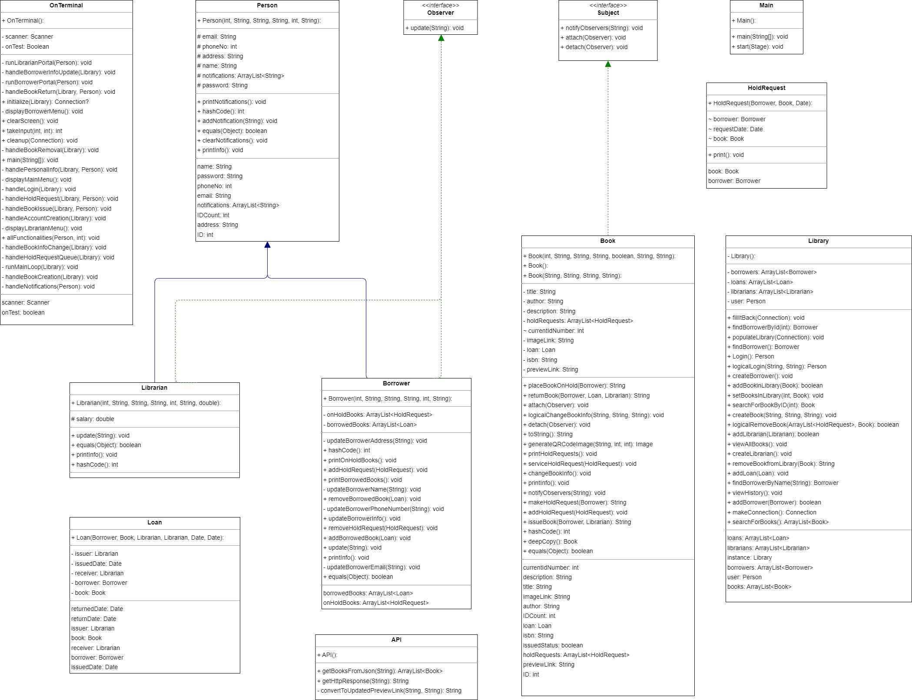
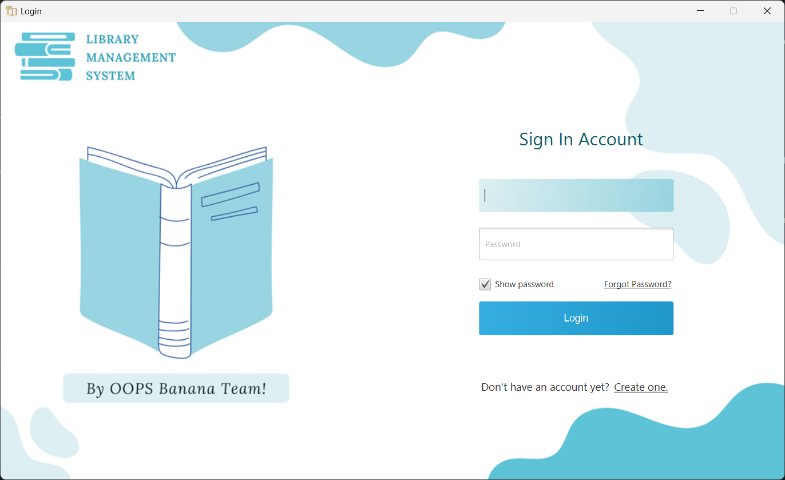
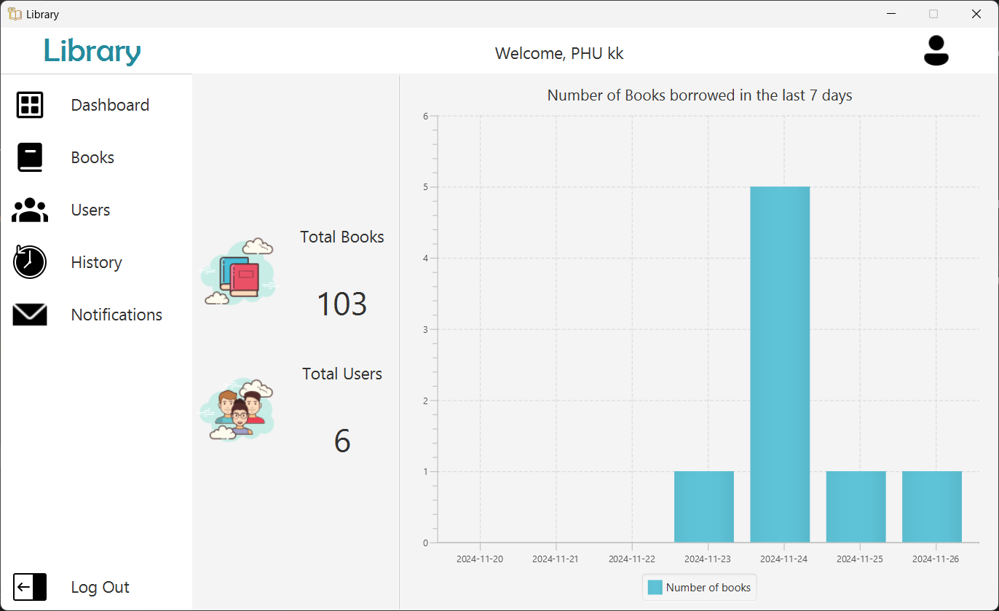

# 📚 Library Management System 📖

- This project is a **Library Management System** built using Java and JavaFX. It allows users to manage books, borrowers, librarians, and loans within a library.

## 🏷️Features

- **User Authentication**: Login and sign-up functionality for borrowers and librarians.
- **Book Management**: View, search, and manage books in the library.
- **Loan Management**: Borrow and return books, view loan history.
- **Notifications**: Receive and manage notifications for various actions.
- **Observer Pattern**: Implemented using `Observer` and `Subject` interfaces for notifications.

## 🏷️Project Structure

- **Controller**: Contains JavaFX controllers for handling UI interactions.
- **Interface**: Contains interfaces for the observer pattern.
- **LMS**: Contains core classes for the library management system.

## 🏷️Class Diagram
- The **Class Diagram** of the project is also provided, the class diagram file can be opened using [Draw.io](https://www.drawio.com/).
- 

## 🏷️Introduction
### Login Scene

### Dashboard Scene


## 🏷️Documentation

- Detailed Javadocs for classes and methods can be viewed here:  
[Library Management System Javadocs](https://docs.google.com/document/d/1dpwNwJr13Be74AY0pTZnNamHlOz3A6TwXpwWe9NqIvc/edit?tab=t.0#heading=h.15w6miidwyig)


## 🏷️Key Classes

### Controller

- **CardController**: Manages the display of book details in a card format.
- **LoginController**: Handles user authentication and account creation.
- **UserController**: Manages the user interface for borrowers, including book and loan management.

### Interface

- **Observer**: Interface for observers in the observer pattern.
- **Subject**: Interface for subjects in the observer pattern.

### LMS

- **Library**: Singleton class that manages the library's data and operations.
- **Book**: Represents a book in the library.
- **Borrower**: Represents a borrower in the library.
- **Librarian**: Represents a librarian in the library.
- **Loan**: Represents a loan of a book to a borrower.
- **HoldRequest**: Represents a hold request for a book.

## 🏷️Setup

### Prerequisites

- Java 11 or higher
- Maven
- JavaFX

### Installation

1. Clone the repository:
   ```sh
   git clone https://github.com/kiennkt05/library-management-system.git
   ```
2. Navigate to the project directory:
   ```sh
   cd library-management-system
   ```
3. Build the project using Maven:
   ```sh
   mvn clean install
   ```

### Running the Application

1. Run the application using Maven:
   ```sh
   mvn javafx:run
   ```

## 🏷️Usage

- **Login**: Use the login form to authenticate as a borrower or librarian.
- **Sign Up**: Create a new account using the sign-up form.
- **Manage Books**: View and search for books in the library.
- **Borrow Books**: Place hold requests and borrow books.
- **View Loans**: View your loan history and current loans.
- **Notifications**: Manage and clear notifications.

## 🏷️Contributing

Contributions are welcome! Please fork the repository and create a pull request with your changes.

## 🏷️License

This project is licensed under the MIT License. See the `LICENSE` file for details.

## 🏷️Contact

For any questions or issues, please contact [kiennkt05](https://github.com/kiennkt05).